# 3. MODELO DEL DOMINIO

En este capítulo se presenta el modelo del dominio del sistema de misiones de seguridad de la plataforma Horizon. El modelo del dominio es una representación de las clases conceptuales más importantes del mundo real en el contexto de la solución propuesta (Larman, 2004). Su objetivo es generar un vocabulario común entre el cliente, los usuarios y los desarrolladores, facilitando la comprensión de la estructura y dinámica del sistema.

El modelo está construido a partir de la información recogida en el Capítulo 1, del análisis del código de la plataforma y del estudio de las APIs de los proveedores cloud con los que el sistema debe integrarse.

Este modelo, con casi total seguridad, cambiará en las siguientes entregas, dado que es muy complicado definir desde el principio tantos factores. Una vez que el código vaya tomando forma, se intentará seguir este modelo, y se harán los cambios necesarios para reflejar el estado actual del proyecto.

## 3.1. Diagrama de clases del dominio

El diagrama de clases del dominio representa las entidades principales del sistema y las relaciones entre ellas. A continuación se describe cada una de las clases conceptuales identificadas y su papel dentro del dominio.

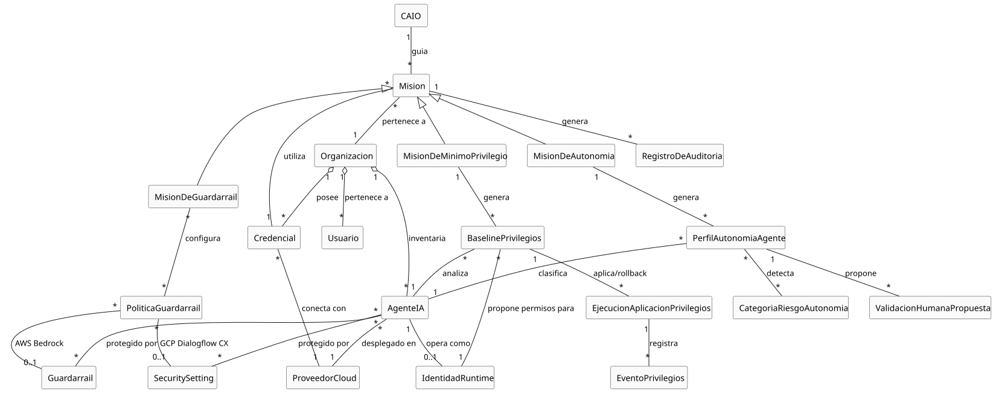

Una `Organizacion` representa a la empresa cliente que utiliza la plataforma Horizon. Cada organización cuenta con uno o varios `Usuarios` que interactúan con el sistema, y posee las `Credenciales` necesarias para conectarse a los distintos `ProveedoresCloud` donde tiene desplegados sus `AgentesIA`.

El concepto central de la plataforma es la `Mision`, un flujo de trabajo guiado por el `CAIO` (Chief AI Officer virtual) mediante el cual el usuario configura y aplica políticas de seguridad sobre sus agentes. Las misiones de seguridad se especializan en tres tipos:

- **`MisionDeGuardarrail`**: permite configurar guardarraíles de seguridad (filtros de contenido, protección anti-jailbreak, detección de PII y bloqueo de temas) y aplicarlos a los agentes del cliente.
- **`MisionDeMinimoPrivilegio`**: analiza los permisos asignados a cada agente y propone la reducción al conjunto mínimo necesario.
- **`MisionDeAutonomia`**: evalúa las tareas de cada agente, asigna un nivel de autonomía y configura la supervisión humana para operaciones de alto riesgo.

Un `Guardarrail` es una política de seguridad que puede contener una o varias configuraciones: `PoliticaDeContenido` (filtros de contenido dañino), `PoliticaDeTemas` (bloqueo de temas sensibles), `PoliticaDePII` (detección y anonimización de información personal) y `PoliticaDeGrounding` (verificación de coherencia en las respuestas).

En el ámbito del mínimo privilegio, cada `AgenteIA` tiene asignados múltiples `Permisos` y genera un `PerfilDeUso` a partir de los logs de actividad del proveedor cloud. La `MisionDeMinimoPrivilegio` produce un `AnalisisDePrivilegios` por agente, que a su vez genera `RecomendacionesDeReduccion` para cada permiso identificado como excesivo.

Para la gestión de la autonomía, cada agente puede ejecutar `OperacionesDeRiesgo`, clasificadas por `CategoriaDeRiesgo` (financiero, datos personales, infraestructura, comunicaciones). La `MisionDeAutonomia` genera una `PoliticaDeAutonomia` por agente, que asigna un `NivelDeAutonomia` (total, supervisado o restringido) y define `ReglasDeSupervision`. Cada regla especifica qué operaciones requieren una `AprobacionHumana` antes de ejecutarse, quién es el aprobador designado y el comportamiento en caso de timeout.

Todas las acciones ejecutadas durante las misiones generan un `RegistroDeAuditoria` que garantiza la trazabilidad del proceso.

La descripción completa de cada clase conceptual se encuentra en el [Glosario](./Capitulo2/Glosario.md).

## 3.2. Diagramas de estados

Los diagramas de estados describen el ciclo de vida de las entidades más relevantes del dominio. Se han modelado siete diagramas que cubren las tres misiones de seguridad y sus entidades asociadas.

### Ciclo de vida genérico de una Misión

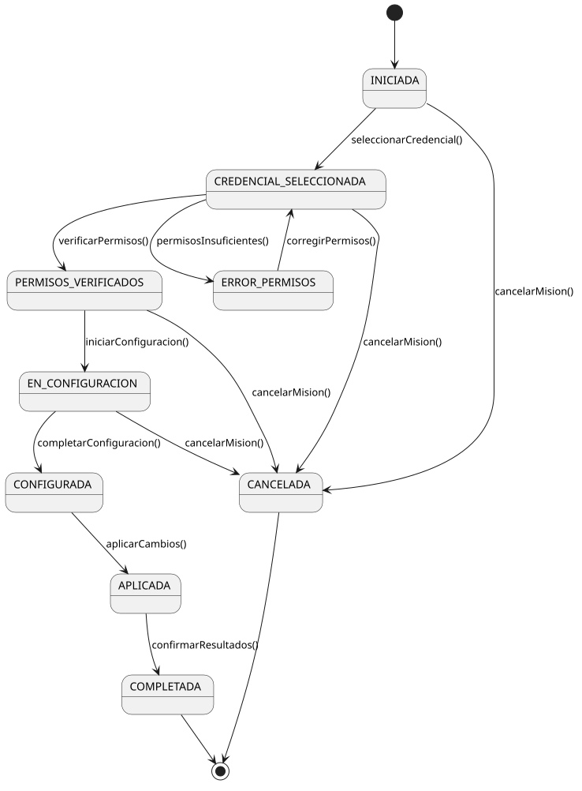

Una misión comienza en estado `Iniciada` cuando el usuario la selecciona desde el catálogo de misiones. El primer paso es la selección de la credencial del proveedor cloud correspondiente (`CredencialSeleccionada`). A continuación, el CAIO verifica que la credencial dispone de los permisos necesarios para ejecutar las operaciones requeridas (`PermisosVerificados`). Si los permisos son insuficientes, la misión pasa a `ErrorDePermisos`, desde donde el usuario puede corregir la configuración IAM y reintentar.

Una vez verificados los permisos, la misión entra en fase de configuración (`EnConfiguracion`), donde el usuario define los parámetros específicos según el tipo de misión. Completada la configuración (`Configurada`), el CAIO ejecuta las acciones correspondientes sobre el proveedor cloud, pasando la misión a `Aplicada`. Finalmente, el usuario confirma los resultados y la misión queda `Completada`. En cualquier momento, el usuario puede cancelar la misión (`Cancelada`).

### Ciclo de vida de un Guardarraíl

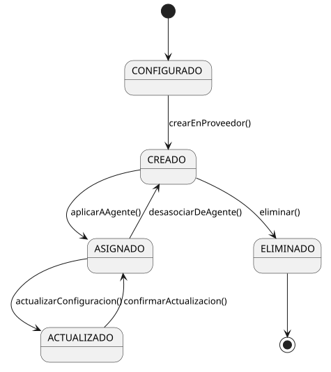

Un guardarraíl comienza en estado `Configurado` cuando el usuario define sus políticas durante la misión de guardarraíles. El CAIO crea el guardarraíl en el proveedor cloud correspondiente (`Creado`). Una vez creado, puede ser asignado a uno o varios agentes (`Asignado`). Un guardarraíl asignado puede ser actualizado con nuevas políticas (`Actualizado`) o desasociado de un agente. También puede ser eliminado del proveedor cloud (`Eliminado`).

### Ciclo de vida de un Agente IA (postura de seguridad)

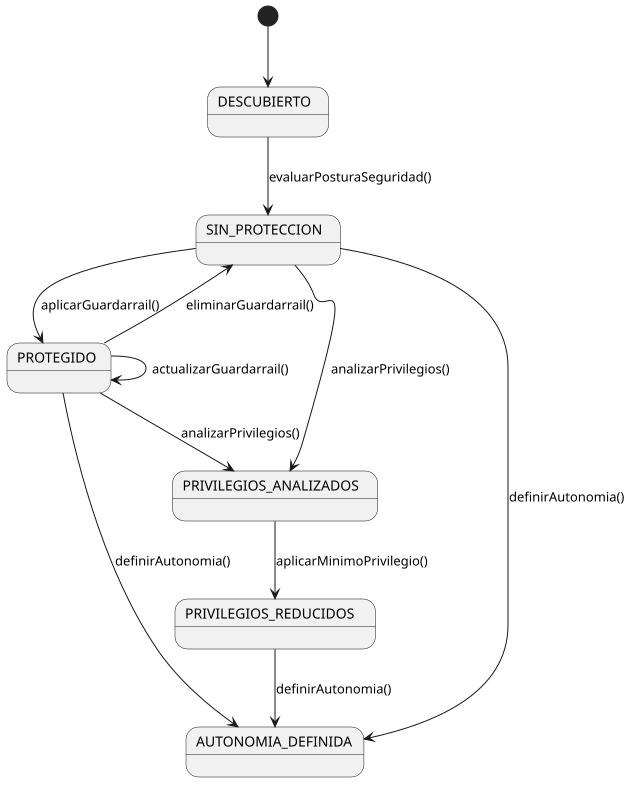

Un agente de IA es inicialmente `Descubierto` cuando la plataforma lo detecta mediante las APIs del proveedor cloud. Tras un análisis inicial, el agente puede encontrarse `SinProteccion` (sin guardarraíles asignados) o ya tener protección previa. Cuando se le aplica un guardarraíl, pasa a estado `Protegido`. Un agente protegido puede recibir actualizaciones en sus guardarraíles o perder su protección si se elimina el guardarraíl.

### Ciclo de vida de la Misión de Mínimo Privilegio

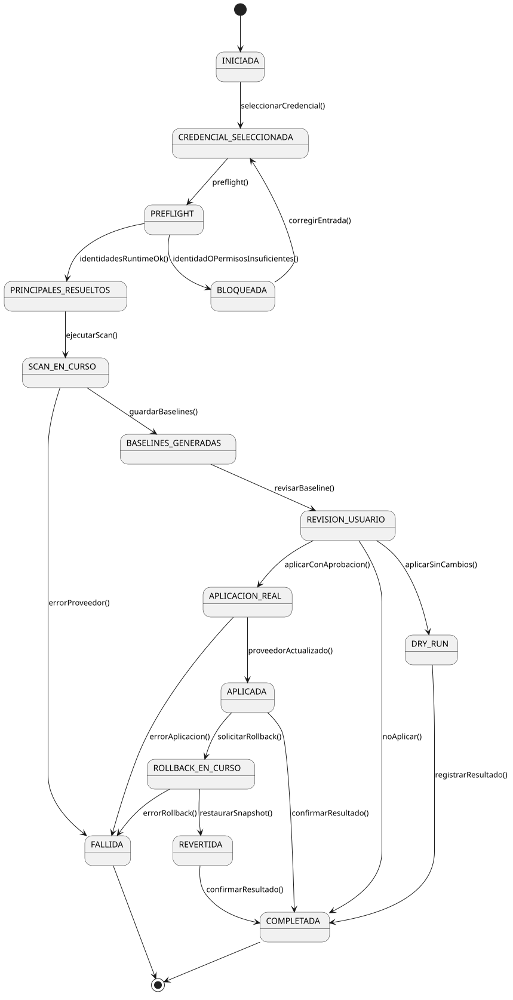

La misión de mínimo privilegio presenta un ciclo de vida más complejo que el genérico, dado que incorpora una fase de análisis de datos que puede fallar si no existe suficiente historial de uso. Tras la verificación de permisos y la selección de agentes, la misión entra en la fase de análisis (`EnAnalisis`), donde el CAIO recopila el historial de uso del agente desde los logs de actividad del proveedor (`RecopilandoDatos`), compara los permisos asignados con los efectivamente utilizados (`ComparandoPermisos`) y genera las recomendaciones (`AnalisisCompletado`).

Si los datos son insuficientes, la misión puede pasar a `DatosInsuficientes`, desde donde el usuario puede ajustar el período de análisis o aceptar la necesidad de un período de observación. Una vez generadas las recomendaciones y revisadas por el usuario, la misión entra en fase de reducción (`ReduccionEnCurso`). Tras aplicar los cambios, el CAIO verifica que los agentes siguen funcionando correctamente (`VerificandoFuncionamiento`). Si un agente falla, se ejecuta un *rollback* automático (`Revertiendo`) que restaura los permisos originales.

### Ciclo de vida de un Análisis de Privilegios

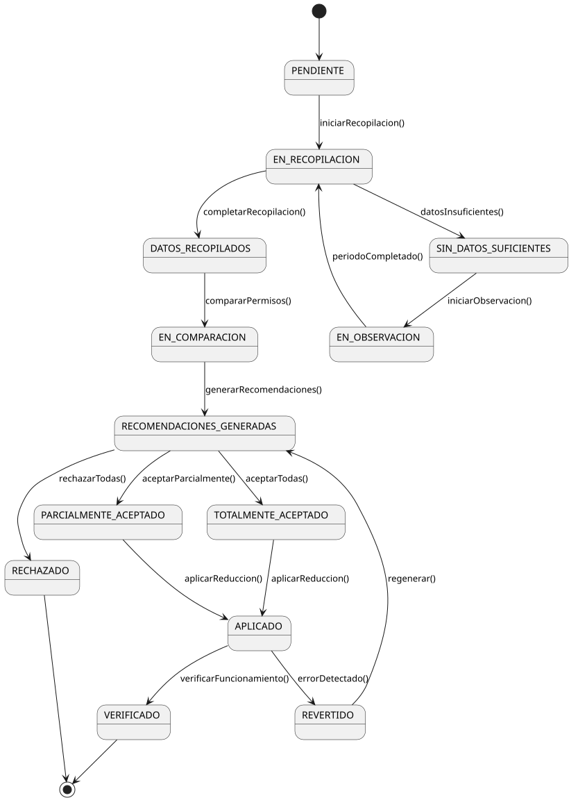

El análisis de privilegios como entidad de dominio tiene su propio ciclo de vida. Comienza `Pendiente` y pasa a `EnRecopilacion` cuando el CAIO consulta los logs de actividad. Si los datos son suficientes, se procede a la comparación y generación de recomendaciones (`RecomendacionesGeneradas`). Las recomendaciones pueden ser aceptadas total o parcialmente por el usuario. Tras la aplicación, el análisis pasa a `Aplicado` y finalmente a `Verificado` si los agentes funcionan correctamente. En caso de error, el análisis se `Revierte` y puede regenerarse.

### Ciclo de vida de la Misión de Autonomía

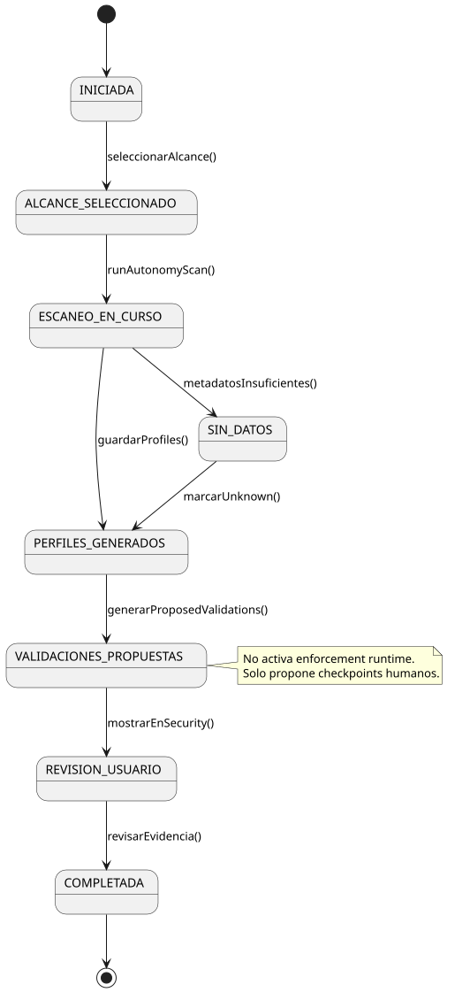

La misión de autonomía incorpora varias fases que no existen en las otras misiones: el análisis de capacidades, la evaluación de riesgo y la configuración de supervisión humana. Tras verificar permisos y listar agentes, el CAIO analiza las herramientas y APIs de cada agente (`CapacidadesAnalizadas`), clasifica sus operaciones por categoría y nivel de riesgo (`RiesgoEvaluado`) y propone niveles de autonomía (`NivelesPropuestos`).

El usuario puede ajustar la clasificación de riesgo si no está de acuerdo con el análisis automático (`RiesgoAjustado`), lo que provoca una nueva propuesta de niveles. Una vez confirmados los niveles (`NivelesAsignados`), se entra en la fase de configuración de supervisión humana, donde se definen las reglas (`ReglasDefinidas`), se asignan los usuarios aprobadores (`AprobadoresAsignados`) y se configura el comportamiento de *timeout* (`TimeoutConfigurado`). Si ningún agente tiene nivel supervisado o restringido, la misión se completa sin esta fase.

### Ciclo de vida de una Política de Autonomía

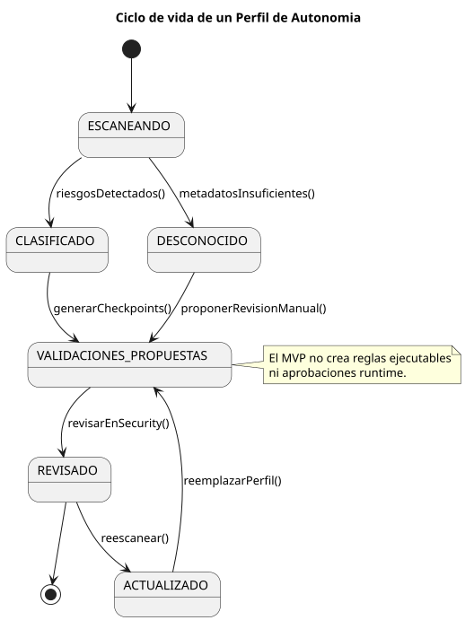

La política de autonomía de un agente comienza como `Borrador` durante la misión. El CAIO evalúa las capacidades del agente (`CapacidadesEvaluadas`) y clasifica el riesgo de sus operaciones (`RiesgoClasificado`). Tras asignar un nivel de autonomía (`NivelAsignado`), se definen las reglas de supervisión si procede (`ReglasDefinidas`) y la política se `Activa`.

Una política activa puede ser revisada periódicamente (`EnRevision`), lo que puede resultar en una reclasificación del riesgo si las capacidades del agente han cambiado. También puede ser `Suspendida` temporalmente (por ejemplo, durante un incidente de seguridad) y posteriormente reactivada o definitivamente `Desactivada`.

## 3.3. Glosario

El glosario completo con las definiciones de todas las clases conceptuales del dominio se encuentra en el documento [Glosario.md](./Capitulo2/Glosario.md).

## 3.4. Requisitos suplementarios

Los requisitos suplementarios, también conocidos como requisitos no funcionales, especifican propiedades del sistema que no se derivan directamente de los casos de uso pero que condicionan su diseño y desarrollo. Se han identificado los siguientes para las misiones de seguridad de Horizon:

**Compatibilidad multi-proveedor**: el sistema debe ser capaz de aplicar políticas de seguridad sobre agentes desplegados en Amazon Web Services, Microsoft Azure y Google Cloud Platform. La arquitectura debe permitir la incorporación de nuevos proveedores sin modificar la lógica de las misiones.

**Seguridad**: las credenciales de los proveedores cloud deben almacenarse cifradas. Todas las operaciones ejecutadas por el CAIO deben quedar registradas en el sistema de auditoría con la identidad del actor, el tipo de acción y la marca temporal. Las comunicaciones con las APIs de los proveedores deben realizarse sobre canales seguros (TLS).

**Usabilidad**: la interacción con el sistema se realiza mediante una interfaz conversacional guiada. El CAIO debe orientar al usuario paso a paso, minimizando la necesidad de conocimientos técnicos avanzados para configurar las políticas de seguridad.

**Rendimiento**: las operaciones de introspección (listado de agentes, verificación de permisos) deben completarse en un tiempo razonable, teniendo en cuenta la latencia inherente a las APIs de los proveedores cloud. Las operaciones de creación y aplicación de guardarraíles no deben superar los 30 segundos por agente.

**Extensibilidad**: la arquitectura debe facilitar la incorporación de nuevos tipos de misiones de seguridad y nuevas políticas de guardarraíles. El sistema de conectores debe permitir extender el soporte a nuevos proveedores cloud mediante la implementación de una interfaz común.

**Cumplimiento normativo**: el sistema debe facilitar el cumplimiento del Reglamento de Inteligencia Artificial de la UE (Parlamento Europeo, 2024) y de la norma ISO/IEC 42001:2023 (ISO, 2023) en lo relativo a supervisión humana y gestión de riesgos de sistemas de IA.

**Trazabilidad**: debe existir trazabilidad completa entre las misiones ejecutadas, las políticas aplicadas, los agentes afectados y los registros de auditoría generados. El historial de cambios debe ser consultable en cualquier momento.

# 4. DISCIPLINA DE REQUISITOS

La disciplina de requisitos tiene como objetivo definir los límites del sistema y formalizar un acuerdo sobre lo que el sistema debe hacer (Jacobson et al., 1999). En este capítulo se identifican los actores que interactúan con el sistema, se definen y priorizan los casos de uso, se detallan los más representativos y se presenta el diagrama de contexto que describe el flujo general de la plataforma.

## 4.1. Actores

Se han identificado tres actores que interactúan con el sistema de misiones de seguridad:

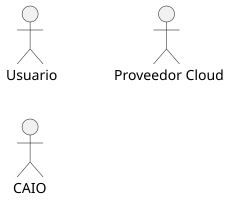

### Usuario

Persona de la organización cliente que utiliza la plataforma Horizon para gestionar la seguridad de sus agentes de IA. Es el actor principal del sistema. Inicia las misiones, proporciona la información solicitada por el CAIO (credenciales, configuraciones, selección de agentes) y confirma la aplicación de los cambios propuestos.

### CAIO

El Chief AI Officer virtual de la plataforma. Es un agente de IA que guía las misiones mediante una interfaz conversacional. Actúa como mediador entre el usuario y los proveedores cloud: analiza la infraestructura del cliente, propone configuraciones, ejecuta acciones sobre las APIs de los proveedores y registra todas las operaciones en el sistema de auditoría. Es un actor sistema que participa en todos los casos de uso.

### Proveedor Cloud

Representa las APIs externas de los proveedores de servicios cloud (Amazon Web Services, Microsoft Azure, Google Cloud Platform). Es un actor externo que recibe las peticiones del sistema para listar agentes, crear guardarraíles, modificar permisos y consultar configuraciones. No inicia interacciones con el sistema; responde a las solicitudes del CAIO.

## 4.2. Casos de uso

A partir del modelo del dominio y los actores identificados, se han definido once casos de uso que cubren las tres misiones de seguridad y las operaciones de soporte necesarias.

### Casos de uso del Usuario

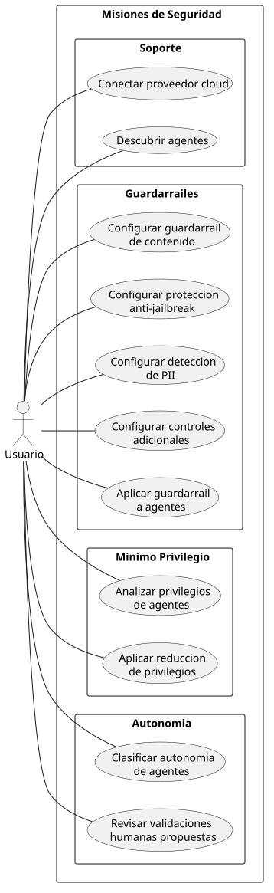

| Nº | Caso de uso | Descripción |
|----|------------|-------------|
| CdU-01 | Conectar proveedor cloud | El usuario proporciona las credenciales de un proveedor cloud para que la plataforma pueda acceder a su infraestructura. |
| CdU-02 | Descubrir agentes | El usuario solicita la detección de todos los agentes de IA desplegados en un proveedor cloud conectado. |
| CdU-03 | Configurar guardarraíl de contenido | El usuario configura filtros de seguridad de contenido (odio, insultos, contenido sexual, violencia) con sus niveles de severidad. |
| CdU-04 | Configurar protección anti-jailbreak | El usuario activa la protección contra intentos de inyección de prompts y manipulación del comportamiento de los agentes. |
| CdU-05 | Configurar detección de PII | El usuario configura la detección y anonimización de información de identificación personal en las entradas y salidas de los agentes. |
| CdU-06 | Configurar bloqueo de temas | El usuario define los temas que los agentes deben rechazar o no responder. |
| CdU-07 | Aplicar guardarraíl a agentes | El usuario selecciona los agentes a los que se aplicará un guardarraíl previamente configurado. |
| CdU-08 | Analizar privilegios de agentes | El usuario solicita un análisis de los permisos asignados a sus agentes para identificar excesos de privilegios. |
| CdU-09 | Aplicar reducción de privilegios | El usuario revisa y confirma la propuesta de reducción de permisos generada por el CAIO. |
| CdU-10 | Definir niveles de autonomía | El usuario define los niveles de autonomía para sus agentes según el riesgo de las operaciones que realizan. |
| CdU-11 | Configurar supervisión humana | El usuario configura qué operaciones de alto riesgo requieren aprobación humana antes de ser ejecutadas por los agentes. |

### Casos de uso del Proveedor Cloud

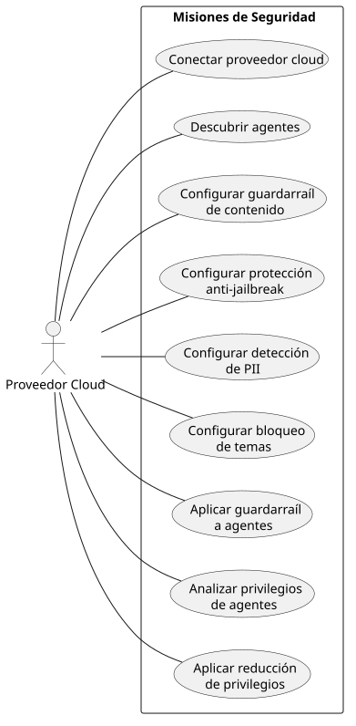

El proveedor cloud participa como actor secundario en los casos de uso CdU-01, CdU-02, CdU-03 a CdU-07, CdU-08 y CdU-09, proporcionando las APIs necesarias para la verificación de credenciales, el descubrimiento de agentes, la creación y aplicación de guardarraíles, y la gestión de permisos.

## 4.3. Priorización de casos de uso

La priorización de los casos de uso se ha realizado considerando aspectos técnicos, de negocio y de riesgo. La tabla completa de priorización con las justificaciones se encuentra en el documento [PriorizarCdU.md](./Capitulo2/CdU/PriorizarCasosUso/PriorizarCdU.md).

| Nº | Caso de uso | Actor principal | Prioridad |
|----|------------|----------------|-----------|
| CdU-01 | Conectar proveedor cloud | Usuario | Alta |
| CdU-02 | Descubrir agentes | Usuario | Alta |
| CdU-03 | Configurar guardarraíl de contenido | Usuario | Alta |
| CdU-04 | Configurar protección anti-jailbreak | Usuario | Alta |
| CdU-05 | Configurar detección de PII | Usuario | Alta |
| CdU-06 | Configurar bloqueo de temas | Usuario | Media |
| CdU-07 | Aplicar guardarraíl a agentes | Usuario | Alta |
| CdU-08 | Analizar privilegios de agentes | Usuario | Media |
| CdU-09 | Aplicar reducción de privilegios | Usuario | Media |
| CdU-10 | Definir niveles de autonomía | Usuario | Media |
| CdU-11 | Configurar supervisión humana | Usuario | Media |

Los casos de uso de prioridad alta se desarrollarán en las primeras iteraciones por ser prerequisitos funcionales (CdU-01, CdU-02) o por constituir el núcleo de la primera misión de seguridad (CdU-03 a CdU-05, CdU-07). Los de prioridad media se abordarán en iteraciones posteriores.

## 4.4. Detalle de casos de uso

A continuación se detallan los casos de uso más representativos del sistema. El detalle completo de todos los casos de uso se encuentra en el documento [DetalleCdU.md](./Capitulo2/CdU/DetalleCasosUso/DetalleCdU.md).

### CdU-03: Configurar guardarraíl de seguridad de contenido

Este caso de uso es representativo del flujo de las misiones de guardarraíles, ya que todos los tipos de guardarraíl (contenido, jailbreak, PII, temas) siguen el mismo patrón de interacción con variaciones en la configuración específica.

**Actores**: Usuario (principal), CAIO (sistema), Proveedor Cloud (secundario).

**Precondiciones**: el usuario ha conectado al menos un proveedor cloud (CdU-01) y ha descubierto sus agentes (CdU-02). La credencial del proveedor tiene los permisos IAM necesarios para crear y gestionar guardarraíles.

**Postcondiciones**: se ha creado un guardarraíl de seguridad de contenido en el proveedor cloud, con las políticas de filtrado configuradas por el usuario.

**Flujo básico**:

1. El usuario inicia la misión de guardarraíl de seguridad de contenido desde el catálogo de misiones.
2. El CAIO solicita al usuario que seleccione la credencial del proveedor cloud que desea utilizar.
3. El usuario selecciona la credencial.
4. El CAIO verifica los permisos de la credencial contra el proveedor cloud, comprobando que dispone de acceso para crear guardarraíles, listar agentes y modificar la configuración de los agentes.
5. El CAIO presenta al usuario las opciones de configuración del filtro de contenido: categorías de filtrado (odio, insultos, contenido sexual, violencia, conductas inapropiadas) y nivel de severidad para cada una (ninguno, bajo, medio, alto).
6. El usuario configura las categorías y niveles de severidad deseados.
7. El CAIO muestra un resumen de la configuración propuesta y solicita confirmación.
8. El usuario confirma la configuración.
9. El CAIO crea el guardarraíl en el proveedor cloud con la configuración definida.
10. El CAIO muestra el resultado de la operación con el identificador del guardarraíl creado.

**Flujo alternativo A — Permisos insuficientes (paso 4)**:

4a. El CAIO detecta que la credencial no tiene los permisos necesarios.
4b. El CAIO informa al usuario de los permisos específicos que faltan y proporciona instrucciones para configurarlos en la consola IAM del proveedor.
4c. El usuario corrige los permisos y solicita una nueva verificación.
4d. Se retoma el flujo básico desde el paso 4.

**Flujo alternativo B — Error en la creación (paso 9)**:

9a. El proveedor cloud devuelve un error en la creación del guardarraíl.
9b. El CAIO informa al usuario del error y propone acciones correctivas.

### CdU-07: Aplicar guardarraíl a agentes

**Actores**: Usuario (principal), CAIO (sistema), Proveedor Cloud (secundario).

**Precondiciones**: existe al menos un guardarraíl creado en el proveedor cloud y al menos un agente descubierto.

**Postcondiciones**: el guardarraíl ha sido asignado a los agentes seleccionados y estos han sido preparados para operar con la nueva configuración de seguridad.

**Flujo básico**:

1. El usuario solicita aplicar un guardarraíl a sus agentes.
2. El CAIO lista los guardarraíles disponibles en el proveedor cloud.
3. El usuario selecciona el guardarraíl que desea aplicar.
4. El CAIO lista los agentes descubiertos y muestra el estado actual de protección de cada uno (si ya tienen un guardarraíl asignado o no).
5. El usuario selecciona los agentes a los que desea aplicar el guardarraíl.
6. El CAIO solicita confirmación de la operación.
7. El usuario confirma.
8. El CAIO aplica el guardarraíl a cada agente seleccionado mediante la API del proveedor cloud. Para cada agente, actualiza su configuración de guardarraíl y prepara el agente para que los cambios surtan efecto.
9. El CAIO muestra el resultado de la operación para cada agente (éxito o error, con detalle).

**Flujo alternativo A — Agente en otra región (paso 8)**:

8a. El agente no se encuentra en la región por defecto de la credencial.
8b. El CAIO busca el agente en las regiones disponibles del proveedor.
8c. Una vez localizado, aplica el guardarraíl en la región correcta.

### CdU-08: Analizar privilegios de agentes

Este caso de uso es representativo de la misión de mínimo privilegio. A diferencia de las misiones de guardarraíles, que aplican configuraciones estáticas, esta misión requiere un análisis dinámico basado en datos de uso reales.

**Actores**: Usuario (principal), CAIO (sistema), Proveedor Cloud (secundario).

**Precondiciones**: el usuario ha conectado un proveedor cloud (CdU-01) y descubierto sus agentes (CdU-02). La credencial tiene permisos de lectura sobre las políticas IAM y los logs de actividad del proveedor (CloudTrail en AWS, Activity Log en Azure, Cloud Audit Logs en GCP).

**Postcondiciones**: se ha generado un análisis de privilegios para cada agente seleccionado, con un informe que clasifica los permisos en tres categorías (utilizados, no utilizados, de alto riesgo no utilizados) y produce recomendaciones de reducción concretas.

**Flujo básico**:

1. El usuario inicia la misión de mínimo privilegio desde el catálogo de misiones.
2. El CAIO solicita la selección de credencial y la verifica, comprobando acceso a políticas IAM y logs de actividad del proveedor.
3. El CAIO lista los agentes descubiertos con su rol IAM asociado y número de permisos asignados.
4. El usuario selecciona los agentes que desea analizar.
5. El usuario define el período de análisis (últimos 30, 60 o 90 días).
6. El CAIO recopila el perfil de uso de cada agente desde los logs de actividad del proveedor, identificando qué permisos ha utilizado durante el período.
7. El CAIO compara permisos asignados con el perfil de uso, clasificando cada permiso como utilizado, no utilizado o de alto riesgo no utilizado.
8. El CAIO genera recomendaciones de reducción: para cada permiso excesivo, indica la justificación, el nivel de riesgo y el impacto estimado de su eliminación.
9. El CAIO presenta el informe completo al usuario, organizado por agente y ordenado por nivel de riesgo.

**Flujo alternativo A — Permisos insuficientes (paso 2)**:

2a. La credencial no tiene acceso a políticas IAM o logs de actividad.
2b. El CAIO identifica los permisos faltantes según el proveedor (por ejemplo, `iam:GetPolicy` y `cloudtrail:LookupEvents` para AWS).
2c. El CAIO proporciona instrucciones específicas para configurarlos.

**Flujo alternativo B — Datos de uso insuficientes (paso 6)**:

6a. Los logs no contienen suficiente información para el período solicitado.
6b. El CAIO ofrece dos opciones: ampliar el rango temporal o activar un período de observación monitorizada.
6c. El usuario elige la opción deseada.

**Flujo alternativo C — Agente sin rol IAM explícito (paso 3)**:

3a. El agente hereda permisos del servicio sin rol IAM dedicado.
3b. El CAIO recomienda crear un rol IAM dedicado antes de proceder.

### CdU-10: Definir niveles de autonomía

Este caso de uso es representativo de la misión de autonomía. A diferencia de las otras misiones, incorpora un análisis de capacidades y una evaluación de riesgo que no depende de datos históricos sino de la configuración actual del agente.

**Actores**: Usuario (principal), CAIO (sistema), Proveedor Cloud (secundario).

**Precondiciones**: el usuario ha conectado un proveedor cloud (CdU-01) y descubierto sus agentes (CdU-02). La credencial tiene permisos para consultar la configuración de los agentes.

**Postcondiciones**: se ha creado una política de autonomía para cada agente seleccionado, con su nivel asignado basado en el análisis de riesgo de sus operaciones.

**Flujo básico**:

1. El usuario inicia la misión de definición de autonomía desde el catálogo.
2. El CAIO solicita la selección de credencial y la verifica.
3. El CAIO lista los agentes con sus herramientas y APIs asignadas.
4. El CAIO analiza las capacidades de cada agente, identificando las operaciones que puede ejecutar.
5. El CAIO clasifica cada operación por categoría de riesgo (financiero, datos personales, infraestructura, comunicaciones) y nivel (bajo, medio, alto, crítico).
6. El CAIO propone un nivel de autonomía por agente: total (solo operaciones de bajo riesgo), supervisado (alguna operación de riesgo medio o alto) o restringido (operaciones de riesgo crítico).
7. El usuario revisa las propuestas y puede aceptar, modificar el nivel o reclasificar operaciones.
8. Si el usuario reclasifica operaciones, el CAIO recalcula las recomendaciones.
9. El CAIO genera una política de autonomía para cada agente con el nivel confirmado.
10. El CAIO muestra el resumen con todos los agentes y sus niveles asignados.

**Flujo alternativo A — Agente sin herramientas asignadas (paso 4)**:

4a. Un agente no tiene herramientas ni APIs (solo genera texto).
4b. El CAIO lo clasifica automáticamente como riesgo bajo y recomienda autonomía total.
4c. El usuario puede aceptar o asignar un nivel más restrictivo.

## 4.5. Diagrama de contexto

El diagrama de contexto describe el flujo general del sistema mediante un diagrama de estados que muestra cómo se relacionan los distintos casos de uso entre sí y cómo el usuario navega a través de la plataforma.

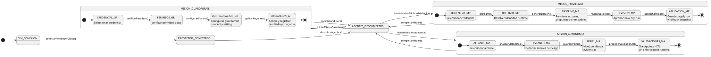

El flujo comienza con la conexión de un proveedor cloud y el descubrimiento de agentes, que son prerrequisitos para todas las misiones de seguridad. Una vez descubiertos los agentes, el usuario puede iniciar cualquiera de las tres misiones de seguridad: guardarraíles, mínimo privilegio o definición de autonomía.

La **misión de guardarraíles** sigue un flujo de cuatro etapas: selección de credencial, verificación de permisos IAM, configuración del guardarraíl (según el tipo: contenido, jailbreak, PII o temas) y selección de agentes para la aplicación.

La **misión de mínimo privilegio** tiene un flujo de seis etapas: selección de credencial, verificación de acceso a logs e IAM, selección de agentes a analizar, análisis de privilegios (recopilación del historial de uso y comparación con permisos asignados), revisión de las recomendaciones de reducción generadas, y aplicación de la reducción con verificación de funcionamiento.

La **misión de autonomía** tiene un flujo de seis etapas: selección de credencial, verificación de acceso a la configuración de agentes, análisis de las herramientas y operaciones de cada agente, evaluación y clasificación del riesgo de cada operación, asignación de niveles de autonomía (total, supervisado, restringido), y configuración de la supervisión humana con definición de reglas, aprobadores y timeouts.

Al completar cualquier misión, el sistema regresa al estado de agentes descubiertos, desde donde el usuario puede iniciar nuevas misiones o revisar el estado de seguridad de sus agentes.

## 4.6. Prototipos de interfaz

Los prototipos de la interfaz de usuario se basan en la implementación existente del frontend de la plataforma Horizon, desarrollado con Next.js. La interacción principal se realiza a través de una interfaz conversacional en la que el CAIO guía al usuario por las distintas etapas de cada misión.

### Catálogo de misiones

La pantalla principal del módulo de misiones presenta un catálogo organizado por categorías (Configuración, Visibilidad, Seguridad, FinOps). Las misiones de seguridad aparecen agrupadas bajo la categoría *Security* y se desbloquean progresivamente: primero las misiones de conexión y descubrimiento, y después las de guardarraíles, mínimo privilegio y autonomía.

Cada tarjeta de misión muestra su nombre, una breve descripción, el proveedor cloud al que aplica y su estado (disponible, en progreso o completada).

### Interfaz conversacional de la misión

Una vez iniciada una misión, la interfaz se divide en dos áreas: el panel de conversación con el CAIO (izquierda) y el panel de contexto con información de la misión (derecha). El panel de conversación permite al usuario interactuar con el CAIO mediante texto libre, mientras que el CAIO presenta opciones de configuración, solicita confirmaciones y muestra los resultados de las operaciones.

El panel de contexto muestra los hitos de la misión (credencial, permisos, configuración, aplicación), el estado actual y los datos de introspección del proveedor cloud.

### Trazabilidad CdU — Pantalla

| Caso de uso | Pantalla |
|------------|----------|
| CdU-01: Conectar proveedor cloud | Catálogo de misiones → Misión de conexión |
| CdU-02: Descubrir agentes | Catálogo de misiones → Misión de descubrimiento |
| CdU-03 a CdU-06: Configurar guardarraíl | Catálogo de misiones → Misión de guardarraíl (tipo específico) |
| CdU-07: Aplicar guardarraíl | Interfaz conversacional (paso final de la misión) |
| CdU-08: Analizar privilegios | Catálogo de misiones → Misión de mínimo privilegio |
| CdU-09: Aplicar reducción | Interfaz conversacional (confirmación tras análisis) |
| CdU-10: Definir autonomía | Catálogo de misiones → Misión de autonomía |
| CdU-11: Configurar supervisión | Interfaz conversacional (dentro de misión de autonomía) |

# Referencias bibliográficas

Amazon Web Services. (2024). *Amazon Bedrock Guardrails*. [https://aws.amazon.com/bedrock/guardrails/](https://aws.amazon.com/bedrock/guardrails/)

Arthur AI. (2024). *Arthur AI: AI Performance Monitoring*. [https://www.arthur.ai/](https://www.arthur.ai/)

Calypso AI. (2024). *Calypso AI: AI Security and Testing Platform*. [https://calypsoai.com/](https://calypsoai.com/)

Google Cloud. (2024). *Vertex AI: Generative AI on Google Cloud*. [https://cloud.google.com/vertex-ai](https://cloud.google.com/vertex-ai)

Greshake, K., Abdelnabi, S., Mishra, S., Endres, C., Holz, T., & Fritz, M. (2023). Not what you've signed up for: Compromising Real-World LLM-Integrated Applications with Indirect Prompt Injection. *Proceedings of the 16th ACM Workshop on Artificial Intelligence and Security*, 79-90. [https://doi.org/10.1145/3605764.3623985](https://doi.org/10.1145/3605764.3623985)

Guardrails AI. (2024). *Guardrails AI: Input/Output Guards for LLMs*. [https://www.guardrailsai.com/](https://www.guardrailsai.com/)

ISO. (2023). *ISO/IEC 42001:2023 — Information technology — Artificial intelligence — Management system*. International Organization for Standardization. [https://www.iso.org/standard/81230.html](https://www.iso.org/standard/81230.html)

Jacobson, I., Booch, G., & Rumbaugh, J. (1999). *The Unified Software Development Process*. Addison-Wesley.

Lakera. (2024). *Lakera Guard: AI Security for LLM Applications*. [https://www.lakera.ai/](https://www.lakera.ai/)

Larman, C. (2004). *Applying UML and Patterns: An Introduction to Object-Oriented Analysis and Design and Iterative Development* (3rd ed.). Prentice Hall.

McKinsey & Company. (2024). *The state of AI in early 2024: Gen AI adoption spikes and starts to generate value*. [https://www.mckinsey.com/capabilities/quantumblack/our-insights/the-state-of-ai](https://www.mckinsey.com/capabilities/quantumblack/our-insights/the-state-of-ai)

Microsoft. (2024). *Azure AI Content Safety*. [https://azure.microsoft.com/en-us/products/ai-services/ai-content-safety](https://azure.microsoft.com/en-us/products/ai-services/ai-content-safety)

NIST. (2023). *Artificial Intelligence Risk Management Framework (AI RMF 1.0)* (NIST AI 100-1). National Institute of Standards and Technology. [https://doi.org/10.6028/NIST.AI.100-1](https://doi.org/10.6028/NIST.AI.100-1)

NVIDIA. (2024). *NeMo Guardrails: Open-Source Toolkit for LLM Safety*. [https://github.com/NVIDIA/NeMo-Guardrails](https://github.com/NVIDIA/NeMo-Guardrails)

OWASP. (2025). *OWASP Top 10 for Large Language Model Applications 2025*. OWASP Foundation. [https://genai.owasp.org/llm-top-10/](https://genai.owasp.org/llm-top-10/)

Parlamento Europeo. (2024). *Reglamento (UE) 2024/1689 del Parlamento Europeo y del Consejo por el que se establecen normas armonizadas en materia de inteligencia artificial (Reglamento de Inteligencia Artificial)*. Diario Oficial de la Unión Europea. [https://eur-lex.europa.eu/eli/reg/2024/1689/oj](https://eur-lex.europa.eu/eli/reg/2024/1689/oj)

Perez, F., & Ribeiro, I. (2022). Ignore This Title and HackAPrompt: Evaluating and Eliciting Prompt Injection Attacks in LLMs. *arXiv preprint arXiv:2211.09527*. [https://arxiv.org/abs/2211.09527](https://arxiv.org/abs/2211.09527)

Protect AI. (2024). *Protect AI: AI/ML Security Platform*. [https://protectai.com/](https://protectai.com/)

Russell, S., & Norvig, P. (2021). *Artificial intelligence: A modern approach* (4th ed.). Pearson.

Saltzer, J. H., & Schroeder, M. D. (1975). The protection of information in computer systems. *Proceedings of the IEEE, 63*(9), 1278-1308. [https://doi.org/10.1109/PROC.1975.9939](https://doi.org/10.1109/PROC.1975.9939)

Shneiderman, B. (2022). *Human-Centered AI*. Oxford University Press.

Wang, L., Ma, C., Feng, X., Zhang, Z., Yang, H., Zhang, J., Chen, Z., Tang, J., Chen, X., Lin, Y., Zhao, W. X., Wei, Z., & Wen, J. (2024). A Survey on Large Language Model based Autonomous Agents. *Frontiers of Computer Science, 18*(6), 186345. [https://doi.org/10.1007/s11704-024-40231-1](https://doi.org/10.1007/s11704-024-40231-1)
