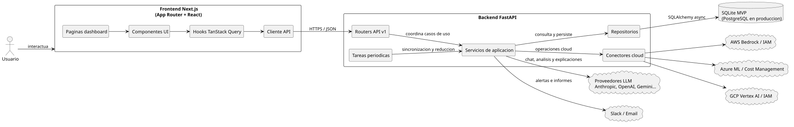
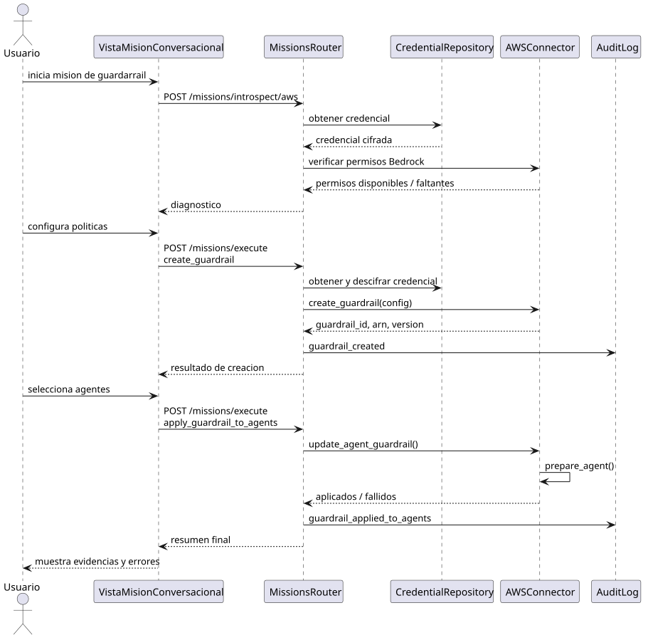
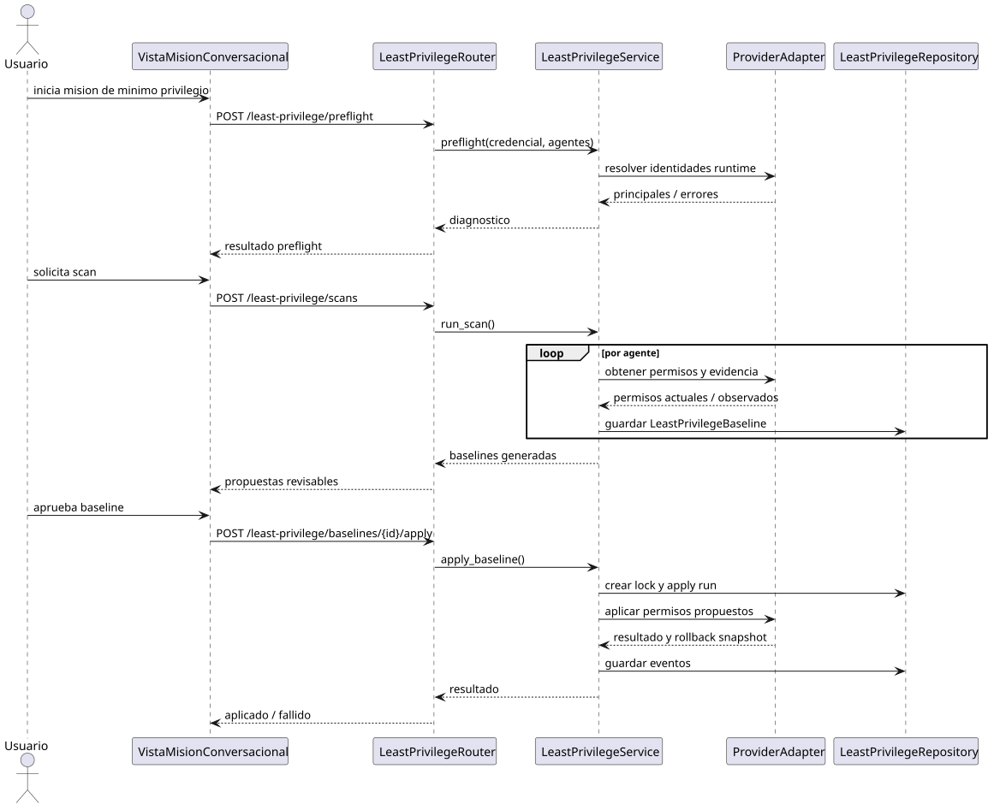
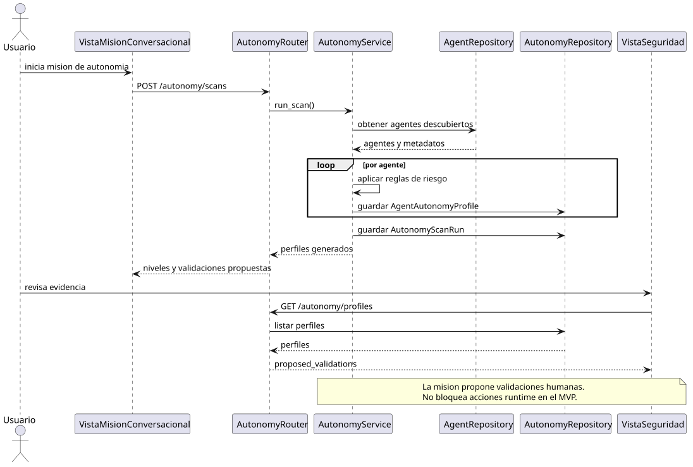
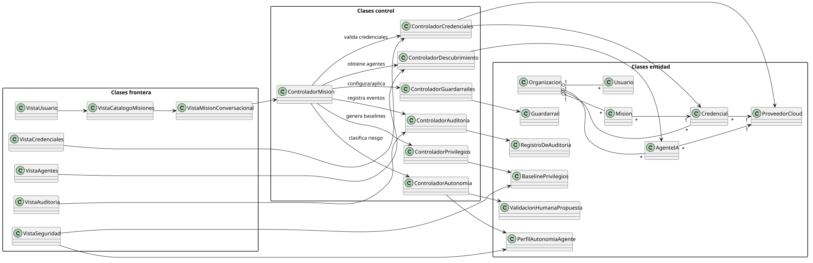
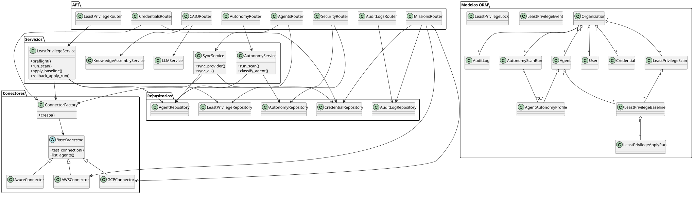
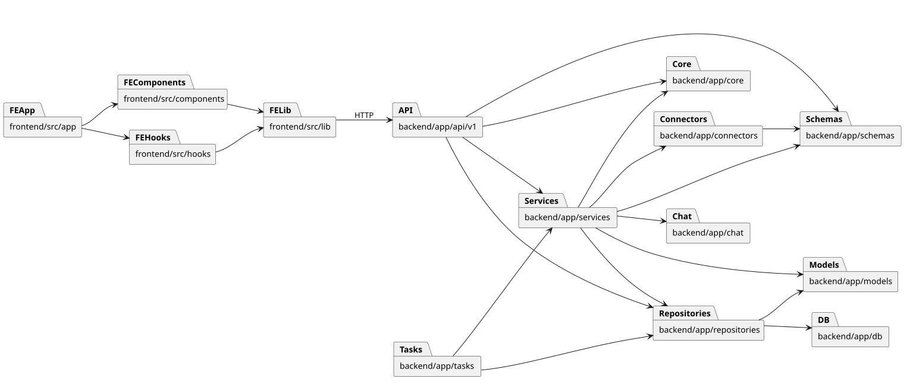
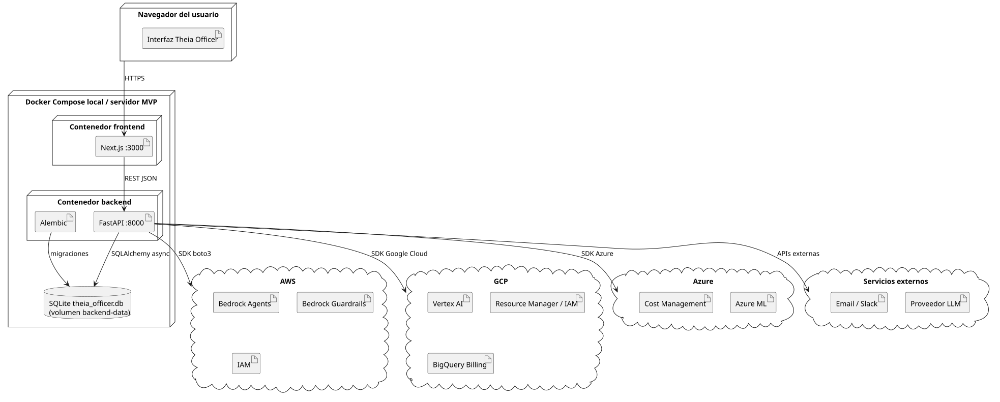
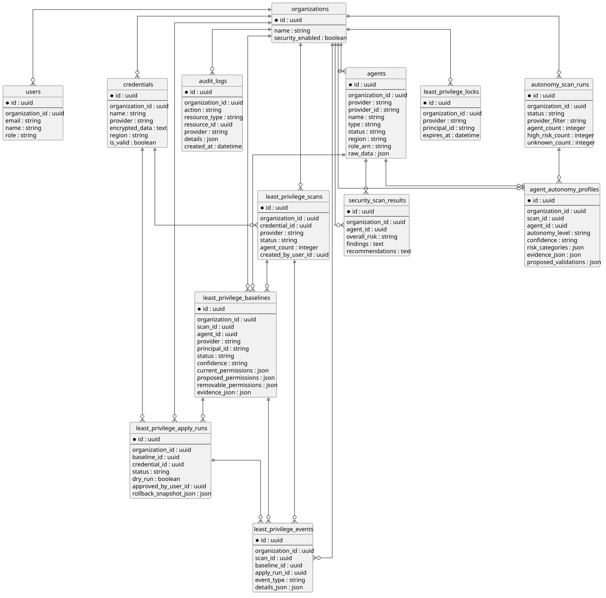

# 4. ANÁLISIS Y DISEÑO

En este capítulo se desarrolla la disciplina de análisis y diseño de la solución propuesta. En el capítulo anterior se habían definido el modelo del dominio, los actores, los casos de uso y el diagrama de contexto. Ahora se toma esa información y se transforma en una visión más cercana a la implementación: clases de análisis, clases de diseño, arquitectura, paquetes, despliegue y modelo de datos.

El objetivo no es repetir los requisitos, sino explicar cómo se materializan en una estructura software concreta. Para ello se ha tenido en cuenta tanto el modelo planteado en la entrega anterior como el estado actual del repositorio `theia-officer-caio-virtual`. Dado que la aplicación todavía se encuentra en una fase de MVP, algunos componentes ya están implementados de forma bastante avanzada, mientras que otros quedan definidos como diseño previsto para las siguientes iteraciones.

La aplicación real se organiza como una plataforma web con un frontend en Next.js, un backend en FastAPI, persistencia mediante SQLAlchemy y una capa de conectores para interactuar con proveedores cloud como AWS, Azure y GCP. Esta estructura encaja con la idea principal del TFG: ofrecer un punto centralizado desde el que el CAIO pueda guiar misiones de seguridad sobre agentes de IA desplegados en distintos proveedores.

## 4.1. Criterios seguidos para el análisis y diseño

Para pasar de los requisitos al diseño se han seguido principalmente los criterios propuestos por el Proceso Unificado. Es decir, se parte de los casos de uso priorizados, se identifican clases de análisis con responsabilidades claras y después se refinan esas clases hasta obtener componentes de diseño más cercanos al código (Jacobson et al., 1999).

La clasificación de clases se ha realizado con el enfoque habitual de clases frontera, clases control y clases entidad:

| Tipo de clase | Papel dentro del sistema | Ejemplo en este TFG |
| --- | --- | --- |
| Clases frontera | Representan los puntos de interacción con usuarios o sistemas externos. | Vista de misiones, vista de credenciales, API REST, conectores cloud. |
| Clases control | Coordinan la ejecución de los casos de uso. | Controlador de misiones, servicio de sincronización, gestor de permisos. |
| Clases entidad | Representan información persistente o conceptos estables del dominio. | Organización, credencial, agente, misión, auditoría, resultado de análisis. |

Además, se han utilizado varios criterios de diseño derivados de los requisitos suplementarios:

- **Extensibilidad**: la incorporación de nuevos proveedores cloud no debe obligar a reescribir las misiones. Por ello se usa una interfaz común de conectores.
- **Trazabilidad**: las acciones relevantes deben quedar registradas mediante logs de auditoría y eventos de permisos.
- **Seguridad**: las credenciales se almacenan cifradas y nunca se devuelven al frontend.
- **Separación de responsabilidades**: la interfaz no contiene lógica de negocio; esta queda en servicios del backend.
- **Compatibilidad con MVP**: se prioriza una arquitectura simple, desplegable localmente y suficientemente clara para evolucionar hacia PostgreSQL y despliegues productivos.

## 4.2. Análisis de la arquitectura

La arquitectura se puede entender como una arquitectura web por capas. El usuario interactúa con un frontend desarrollado en Next.js. Este frontend se comunica mediante peticiones HTTP con un backend FastAPI. El backend coordina la lógica de negocio, consulta la base de datos y se comunica con los proveedores cloud mediante conectores específicos.

Archivo fuente del diagrama: [Arquitectura.uml](./Capitulo3/Diseno/Arquitectura/Arquitectura.uml).

La decisión de separar frontend, backend y conectores cloud es importante porque evita que la aplicación dependa directamente de un proveedor concreto. En lugar de que cada misión conozca los detalles de AWS, Azure o GCP, el backend trabaja con servicios y conectores que encapsulan esas diferencias.

El frontend contiene principalmente:

- Las páginas del dashboard, como misiones, agentes, credenciales, auditoría y seguridad.
- Componentes reutilizables para tablas, formularios, paneles de misión y diálogos de confirmación.
- Hooks basados en TanStack Query para consultar y actualizar datos.
- Un cliente API común que centraliza las llamadas al backend.

El backend contiene:

- Routers FastAPI que exponen los casos de uso como endpoints.
- Servicios de aplicación que contienen la lógica principal.
- Repositorios que aíslan el acceso a datos.
- Modelos ORM que representan las tablas de la base de datos.
- Conectores cloud para AWS, Azure y GCP.
- Tareas periódicas para sincronización, salud de misiones y reducción de permisos.

En conjunto, la arquitectura se ha diseñado para que el CAIO no sea simplemente un chat, sino una capa de coordinación entre el usuario, la infraestructura cloud y los registros de gobierno.

## 4.3. Análisis de casos de uso

Los casos de uso definidos en la entrega anterior se agrupan en tres bloques funcionales: conexión y descubrimiento, guardarraíles, y gobierno avanzado mediante privilegios y autonomía.

| Caso de uso | Control principal de análisis | Componentes de diseño relacionados |
| --- | --- | --- |
| CdU-01 Conectar proveedor cloud | ControladorCredenciales | `credentials.py`, `CredentialRepository`, `ConnectorFactory`, `CredentialEncryptor` |
| CdU-02 Descubrir agentes | ControladorDescubrimiento | `agents.py`, `SyncService`, `AgentRepository`, conectores cloud |
| CdU-03 a CdU-06 Configurar guardarraíl | ControladorGuardarrailes | `missions.py`, `AWSConnector`, configuración de guardrails |
| CdU-07 Aplicar guardarraíl a agentes | ControladorGuardarrailes | `update_agent_guardrail`, `prepare_agent`, auditoría |
| CdU-08 Analizar privilegios | ControladorPrivilegios | `least_privilege.py`, `LeastPrivilegeService`, `LeastPrivilegeBaseline` |
| CdU-09 Aplicar reducción de privilegios | ControladorPrivilegios | `LeastPrivilegeApplyRun`, aprobación explícita, locks y rollback |
| CdU-10 Clasificar autonomía | ControladorAutonomia | `autonomy.py`, `AutonomyService`, `AgentAutonomyProfile` |
| CdU-11 Revisar validaciones humanas propuestas | ControladorAutonomia | `proposed_validations` y vista de seguridad |

### Conexión y descubrimiento de agentes

Los casos de uso de conexión y descubrimiento son los prerequisitos del resto del sistema. Sin credenciales válidas no es posible listar agentes, crear guardarraíles ni analizar permisos. En el diseño actual, el usuario introduce las credenciales desde la interfaz, el backend las valida mediante el conector correspondiente y solo después las almacena cifradas.

Una vez que existe una credencial válida, el servicio de sincronización ejecuta el flujo completo: descifra la credencial, crea el conector, lista los agentes del proveedor, normaliza los datos y actualiza la base de datos. Esta normalización es clave, ya que permite tratar como `AgenteIA` a entidades que internamente son diferentes según el proveedor.

### Guardarraíles

Las misiones de guardarraíles son el bloque más directamente relacionado con la seguridad de contenido. En la implementación actual, el soporte real está centrado en AWS Bedrock Guardrails. Esto es coherente con el estado del arte descrito en el trabajo, porque Bedrock es la plataforma que ofrece una API más clara para crear y asociar guardarraíles a agentes.

Archivo fuente del diagrama: [GuardarrailesSecuencia.uml](./Capitulo3/Analisis/CasosUso/GuardarrailesSecuencia.uml).

El flujo se divide en tres partes: verificación de permisos IAM, creación o actualización del guardarraíl y aplicación sobre uno o varios agentes. La fase de verificación es necesaria porque las operaciones de guardarraíles no solo requieren crear el recurso, sino también obtener el agente, actualizar su configuración y prepararlo para que los cambios surtan efecto.

### Mínimo privilegio

La misión de mínimo privilegio se diseña alrededor de una idea simple: cada agente debe conservar solo los permisos necesarios para operar. En el código final esta misión tiene un módulo específico, no depende del ciclo de permisos de misiones autónomas.

Archivo fuente del diagrama: [MinimoPrivilegioSecuencia.uml](./Capitulo3/Analisis/CasosUso/MinimoPrivilegioSecuencia.uml).

En el código actual esta lógica se implementa mediante `least_privilege.py` y `LeastPrivilegeService`. El flujo ejecuta un preflight para resolver identidades runtime, genera `LeastPrivilegeBaseline` por agente, permite revisión humana y aplica cambios solo con aprobación explícita o en modo dry-run. Si se aplican cambios, se crea un `LeastPrivilegeApplyRun` con snapshot de rollback.

### Autonomía y supervisión humana

La misión de autonomía tiene un módulo específico en el código final. No se basa en el análisis OWASP general ni crea una política ejecutable; analiza metadatos de agentes y genera perfiles de autonomía con recomendaciones de validación humana.

Archivo fuente del diagrama: [AutonomiaSecuencia.uml](./Capitulo3/Analisis/CasosUso/AutonomiaSecuencia.uml).

La idea implementada es que `AutonomyService` detecte señales como pagos, escritura de datos, IAM/RBAC, datos sensibles, comunicaciones externas, cambios en producción o ejecución de código. El resultado se guarda como `AgentAutonomyProfile`, con nivel `low`, `medium`, `high` o `unknown`, evidencias y `proposed_validations`. El enforcement runtime queda fuera del MVP.

## 4.4. Clases de análisis

El diagrama de clases de análisis muestra la primera transición desde los casos de uso hacia una estructura orientada a responsabilidades. No intenta representar todavía clases concretas del código, sino los roles que deben existir para cumplir los requisitos.

Archivo fuente del diagrama: [ClasesAnalisis.uml](./Capitulo3/Analisis/ClasesAnalisis/ClasesAnalisis.uml).

### Clases frontera

Las clases frontera representan la interacción con el usuario. En este proyecto no son ventanas de escritorio clásicas, sino páginas y componentes web. Las más importantes son:

| Clase frontera | Responsabilidad |
| --- | --- |
| `VistaCatalogoMisiones` | Mostrar las misiones disponibles y permitir iniciar una de ellas. |
| `VistaMisionConversacional` | Permitir que el usuario dialogue con el CAIO y avance por hitos. |
| `VistaCredenciales` | Crear, listar y validar credenciales cloud. |
| `VistaAgentes` | Mostrar el inventario normalizado de agentes. |
| `VistaAuditoria` | Consultar acciones registradas y evidencias de trazabilidad. |

### Clases control

Las clases control coordinan la realización de los casos de uso. En el diseño se han identificado las siguientes:

| Clase control | Casos de uso relacionados |
| --- | --- |
| `ControladorCredenciales` | CdU-01 |
| `ControladorDescubrimiento` | CdU-02 |
| `ControladorGuardarrailes` | CdU-03 a CdU-07 |
| `ControladorPrivilegios` | CdU-08 y CdU-09 |
| `ControladorAutonomia` | CdU-10 y CdU-11 |
| `ControladorAuditoria` | Trazabilidad transversal |

Estas clases control no aparecen literalmente con esos nombres en el código, pero se corresponden con routers y servicios del backend. Por ejemplo, `ControladorGuardarrailes` se materializa principalmente en `missions.py` y los conectores cloud, `ControladorPrivilegios` en `least_privilege.py` y `LeastPrivilegeService`, y `ControladorAutonomia` en `autonomy.py` y `AutonomyService`.

### Clases entidad

Las clases entidad proceden del modelo del dominio y de las tablas reales del sistema. Entre ellas destacan `Organizacion`, `Usuario`, `Credencial`, `AgenteIA`, `Guardarrail`, `BaselinePrivilegios`, `PerfilAutonomiaAgente` y `RegistroDeAuditoria`.

En el diseño final algunas de estas entidades tienen una correspondencia directa con modelos ORM (`Organization`, `User`, `Credential`, `Agent`, `AuditLog`, `LeastPrivilegeBaseline`, `LeastPrivilegeApplyRun`, `AutonomyScanRun`, `AgentAutonomyProfile`). Los guardarraíles dependen más del proveedor: AWS usa Bedrock Guardrails y GCP Security Settings para los casos soportados.

## 4.5. Transición de análisis a diseño

La transición de análisis a diseño consiste en convertir las responsabilidades abstractas en clases, módulos y paquetes concretos. La siguiente tabla resume esa correspondencia:

| Elemento de análisis | Elemento de diseño | Justificación |
| --- | --- | --- |
| `VistaMisionConversacional` | `missions-content.tsx`, componentes de misión | Centraliza la experiencia guiada por hitos y conversación. |
| `ControladorCredenciales` | `credentials.py`, `CredentialRepository`, `CredentialEncryptor` | Gestiona validación, cifrado y persistencia de credenciales. |
| `ControladorDescubrimiento` | `SyncService`, `ConnectorFactory`, `AgentRepository` | Coordina el descubrimiento multi-proveedor y normaliza agentes. |
| `ControladorGuardarrailes` | `missions.py`, `AWSConnector`, `GCPConnector` | Ejecuta creación, actualización y aplicación de guardarraíles/security settings. |
| `ControladorPrivilegios` | `least_privilege.py`, `LeastPrivilegeService` | Genera baselines, aplica cambios aprobados y conserva rollback. |
| `ControladorAutonomia` | `autonomy.py`, `AutonomyService` | Clasifica agentes y propone validaciones humanas. |
| `RegistroDeAuditoria` | `AuditLog`, `LeastPrivilegeEvent` | Mantiene trazabilidad funcional y trazabilidad específica de mínimo privilegio. |

Esta transición también muestra una decisión importante: no se ha creado una clase controladora por cada caso de uso de manera literal. En su lugar, se agrupan responsabilidades relacionadas en servicios. Esto reduce duplicación y mantiene mayor cohesión.

## 4.6. Clases de diseño

Las clases de diseño representan ya la estructura técnica de la solución. En este punto sí se consideran clases y módulos existentes en el repositorio.

Archivo fuente del diagrama: [ClasesDiseno.uml](./Capitulo3/Diseno/ClasesDiseno/ClasesDiseno.uml).

### Routers API

Los routers de FastAPI son la puerta de entrada al backend. Cada router agrupa endpoints de un área funcional:

| Router | Responsabilidad |
| --- | --- |
| `credentials.py` | Crear, listar, borrar, validar credenciales y lanzar sincronizaciones. |
| `agents.py` | Consultar agentes, estadísticas, cumplimiento y evidencias. |
| `missions.py` | Gestionar chat de misión, introspección y ejecución de acciones cloud. |
| `least_privilege.py` | Gestionar preflight, scans, baselines, apply runs y rollback de mínimo privilegio. |
| `autonomy.py` | Gestionar scans de autonomía y perfiles por agente. |
| `security.py` | Mostrar evidencias complementarias de postura de seguridad. |
| `audit_logs.py` | Consultar eventos de auditoría e interpretarlos con el CAIO. |
| `caio.py` | Gestionar el chat general del CAIO y su memoria conversacional. |

### Servicios

Los servicios contienen la lógica principal. Son los componentes más importantes desde el punto de vista de diseño:

| Servicio | Responsabilidad |
| --- | --- |
| `SyncService` | Descubrir agentes de un proveedor y sincronizarlos con la base de datos. |
| `LeastPrivilegeService` | Resolver identidades runtime, generar baselines, aplicar cambios aprobados y ejecutar rollback. |
| `AutonomyService` | Clasificar agentes por señales de riesgo y guardar perfiles de autonomía. |
| `LLMService` | Abstraer múltiples proveedores de modelos y registrar uso/coste. |
| `KnowledgeAssemblyService` | Construir contexto para el CAIO a partir de datos de la organización. |

### Repositorios

Los repositorios aíslan el acceso a datos. Esta decisión facilita cambiar detalles de persistencia sin afectar a la lógica de negocio. En el MVP se utiliza SQLite, pero el diseño no queda atado a SQLite, ya que el acceso pasa por SQLAlchemy y repositorios específicos.

### Conectores cloud

El patrón de conectores es uno de los puntos más importantes de la arquitectura. `BaseConnector` define una interfaz común con operaciones como `test_connection()` y `list_agents()`. Las clases `AWSConnector`, `AzureConnector` y `GCPConnector` implementan esa interfaz para cada proveedor.

Este diseño permite que el resto del sistema trabaje con agentes normalizados. La diferencia entre un agente de Bedrock, un endpoint de Azure ML o un recurso de Vertex AI queda encapsulada en el conector y su normalizador.

## 4.7. Diseño de casos de uso representativos

### CdU-01 y CdU-02: conectar proveedor y descubrir agentes

El usuario introduce una credencial desde la interfaz. El backend recibe la petición, crea el conector correspondiente y prueba la conexión contra el proveedor. Si la credencial es válida, se cifra con `CredentialEncryptor` y se almacena en la tabla `credentials`.

Después, para descubrir agentes, `SyncService` descifra la credencial, instancia el conector mediante `ConnectorFactory`, llama a `list_agents()` y guarda los agentes en formato normalizado. El diseño evita guardar duplicados mediante una restricción única formada por organización, proveedor e identificador del proveedor.

### CdU-03 a CdU-07: configurar y aplicar guardarraíles

El diseño de guardarraíles se ha planteado como una misión conversacional con hitos. Primero el usuario selecciona credencial y región. Después el sistema comprueba los permisos necesarios para operar con Bedrock Guardrails. Si falta algún permiso, el CAIO informa al usuario de los permisos concretos.

Cuando los permisos son correctos, el usuario configura la política: filtros de contenido, protección contra prompt injection, PII, temas bloqueados, filtros de lenguaje o grounding. La configuración se transforma en el formato esperado por la API de Bedrock y se envía mediante `AWSConnector`.

Finalmente, el usuario selecciona los agentes objetivo y el sistema ejecuta `update_agent_guardrail()`. Después se llama a `prepare_agent()` para que la nueva configuración se aplique de forma efectiva. Esta parte es importante porque crear el guardarraíl no basta: debe quedar asociado al agente y preparado para ejecución.

### CdU-08 y CdU-09: analizar y reducir privilegios

El diseño de mínimo privilegio se apoya en `LeastPrivilegeService`. El flujo real es:

1. Ejecutar preflight sobre credencial y agentes.
2. Resolver la identidad runtime de cada agente.
3. Obtener permisos actuales y evidencias disponibles.
4. Generar `LeastPrivilegeBaseline`.
5. Exigir revisión y aprobación explícita para aplicar cambios reales.
6. Crear `LeastPrivilegeApplyRun` y snapshot de rollback.
7. Ejecutar rollback si el usuario lo solicita o si la operación debe revertirse.

Este diseño cubre una parte muy relevante del principio de mínimo privilegio: no aplicar cambios sin evidencia, revisión y posibilidad de reversión.

### CdU-10 y CdU-11: autonomía y supervisión humana

La parte de autonomía se diseña usando `AutonomyService`. El servicio analiza metadatos de los agentes descubiertos y produce un perfil de autonomía por agente.

El perfil contiene:

- Nivel de autonomía (`low`, `medium`, `high` o `unknown`).
- Categorías de riesgo detectadas.
- Evidencias que justifican la clasificación.
- Validaciones humanas propuestas.

Aunque las validaciones humanas se proponen, el MVP no intercepta acciones runtime ni crea un flujo de aprobaciones ejecutable.

## 4.8. Diseño arquitectónico

La arquitectura propuesta responde directamente a los requisitos no funcionales:

| Requisito no funcional | Decisión de diseño |
| --- | --- |
| Compatibilidad multi-proveedor | Interfaz `BaseConnector` y conectores específicos por proveedor. |
| Seguridad | Cifrado de credenciales, validación previa y no exposición de secretos. |
| Usabilidad | Interfaz conversacional con misiones guiadas por hitos. |
| Rendimiento | Sincronización por proveedor, paginación y consultas acotadas. |
| Extensibilidad | Separación entre routers, servicios, repositorios y conectores. |
| Cumplimiento normativo | Auditoría persistente, evidencias y análisis de riesgo. |
| Trazabilidad | `AuditLog` y `LeastPrivilegeEvent` como registros históricos. |

La decisión de usar FastAPI en el backend facilita definir una API clara, tipada con esquemas Pydantic y documentada automáticamente. SQLAlchemy permite trabajar con SQLite durante el MVP y migrar a PostgreSQL sin cambiar el modelo conceptual. En el frontend, Next.js permite construir una interfaz modular y orientada a componentes, adecuada para un producto B2B.

Otra decisión relevante es separar el chat del CAIO de la ejecución de acciones. El CAIO puede guiar al usuario mediante lenguaje natural, pero las acciones reales pasan por endpoints concretos, validaciones y servicios. Esto evita que una respuesta del modelo ejecute cambios sin control.

## 4.9. Diagrama de paquetes

El diagrama de paquetes muestra la organización física del código y las dependencias principales.

Archivo fuente del diagrama: [Paquetes.uml](./Capitulo3/Diseno/Paquetes/Paquetes.uml).

En el frontend, la separación principal se da entre páginas (`app`), componentes (`components`), hooks (`hooks`) y utilidades (`lib`). Esta división permite que las páginas se mantengan relativamente limpias y deleguen la interacción con el backend a hooks y cliente API.

En el backend, la separación es más marcada:

- `api/v1`: define endpoints y dependencias de entrada.
- `services`: contiene la lógica de aplicación.
- `repositories`: encapsula consultas y persistencia.
- `models`: define las tablas ORM.
- `schemas`: define contratos de entrada y salida.
- `connectors`: contiene integraciones con proveedores cloud.
- `tasks`: ejecuta trabajo periódico o diferido.
- `core`: agrupa seguridad, logging, errores y configuración.

Esta organización ayuda a que la solución sea mantenible. Por ejemplo, añadir soporte a otro proveedor cloud debería afectar principalmente a `connectors`, normalizadores y algunos servicios, no a toda la aplicación.

## 4.10. Diagrama de despliegue

El despliegue del MVP se plantea mediante Docker Compose. Existen dos contenedores principales: frontend y backend. El backend utiliza un volumen para persistir los datos de SQLite, y desde él se realizan las conexiones hacia proveedores cloud y servicios externos.

Archivo fuente del diagrama: [Despliegue.uml](./Capitulo3/Diseno/Despliegue/Despliegue.uml).

Esta configuración es suficiente para el desarrollo y la validación del MVP. Permite levantar el sistema completo con un único comando y evita depender de instalaciones locales de Python o Node. Para producción, el diseño debería evolucionar hacia un despliegue con base de datos gestionada, almacenamiento seguro de secretos y separación más estricta entre entornos.

## 4.11. Modelo lógico y físico de datos

El modelo de datos real se basa en modelos SQLAlchemy. El MVP utiliza SQLite, pero la estructura ya está preparada para migrar a PostgreSQL si la aplicación crece.

Archivo fuente del diagrama: [DER.uml](./Capitulo3/Diseno/ModeloDatos/DER.uml).

Las tablas principales son:

| Tabla | Función |
| --- | --- |
| `organizations` | Representa la organización cliente y su configuración general. |
| `users` | Usuarios pertenecientes a una organización. |
| `credentials` | Credenciales cloud cifradas por organización y proveedor. |
| `agents` | Inventario normalizado de agentes descubiertos. |
| `least_privilege_scans` | Ejecuciones de análisis de mínimo privilegio. |
| `least_privilege_baselines` | Propuestas de permisos mínimos por agente. |
| `least_privilege_apply_runs` | Aplicaciones, dry-runs y rollbacks de baselines. |
| `least_privilege_events` | Eventos de auditoría específicos de mínimo privilegio. |
| `least_privilege_locks` | Bloqueos temporales para evitar cambios concurrentes. |
| `autonomy_scan_runs` | Ejecuciones de clasificación de autonomía. |
| `agent_autonomy_profiles` | Perfiles de autonomía por agente con evidencias y validaciones propuestas. |
| `audit_logs` | Auditoría general de acciones de la plataforma. |
| `security_scan_results` | Resultados de análisis de riesgo por agente. |
| `llm_configs` | Configuración de proveedores LLM por organización. |
| `llm_usage_logs` | Coste y uso de tokens por operación. |

Una decisión importante del modelo es que casi todas las tablas dependen de `organization_id`. Esto permite aislar datos por organización, que es un requisito fundamental en una aplicación B2B. Además, tanto `audit_logs` como `permission_events` están diseñadas como registros append-only, es decir, no se actualizan ni eliminan durante el flujo normal. Esto favorece la trazabilidad.

## 4.12. Trazabilidad entre requisitos, análisis y diseño

La siguiente tabla resume cómo se mantiene la trazabilidad desde los requisitos hasta los artefactos de diseño:

| Requisito / caso de uso | Clase de análisis | Clase o módulo de diseño | Artefacto |
| --- | --- | --- | --- |
| Conectar proveedor cloud | `ControladorCredenciales` | `CredentialRepository`, `ConnectorFactory` | Clases de diseño, DER |
| Descubrir agentes | `ControladorDescubrimiento` | `SyncService`, `AgentRepository` | Arquitectura, clases de diseño |
| Configurar guardarraíl | `ControladorGuardarrailes` | `missions.py`, `AWSConnector` | Secuencia de guardarraíles |
| Aplicar guardarraíl | `ControladorGuardarrailes` | `update_agent_guardrail`, `prepare_agent` | Secuencia de guardarraíles |
| Analizar privilegios | `ControladorPrivilegios` | `LeastPrivilegeService`, `LeastPrivilegeBaseline` | Secuencia de mínimo privilegio |
| Reducir privilegios | `ControladorPrivilegios` | `LeastPrivilegeApplyRun`, rollback snapshot | DER, clases de diseño |
| Clasificar autonomía | `ControladorAutonomia` | `AutonomyService`, `AgentAutonomyProfile` | Secuencia de autonomía |
| Revisar validaciones humanas | `ControladorAutonomia` | `proposed_validations`, vista `/security` | Secuencia de autonomía |
| Registrar auditoría | `ControladorAuditoria` | `AuditLog`, `LeastPrivilegeEvent` | DER, arquitectura |

Esta trazabilidad es especialmente importante en este TFG porque el sistema todavía está evolucionando. Al dejar clara la relación entre requisitos y componentes, es más sencillo justificar qué partes se han implementado ya, cuáles están en diseño y cuáles se deben abordar en próximas iteraciones.

## 4.13. Limitaciones del diseño actual

El diseño presentado es coherente con el MVP actual, pero existen limitaciones que deben quedar claras:

1. El soporte completo de guardarraíles está implementado principalmente para AWS Bedrock. GCP se soporta en controles concretos mediante Security Settings y Azure no se expone como guardarrail implementado.
2. La misión de mínimo privilegio depende de poder resolver la identidad runtime y obtener evidencia suficiente. Si no es posible, la baseline queda bloqueada o con baja confianza.
3. La misión de autonomía genera perfiles y propuestas de validación humana, pero no ejecuta enforcement runtime ni aprobaciones obligatorias.
4. El MVP usa SQLite por simplicidad. Para producción sería recomendable PostgreSQL, especialmente si se quieren ejecutar sincronizaciones concurrentes y auditorías de gran volumen.
5. Algunas misiones aparecen en el catálogo del frontend como futuras o no implementadas. Esto es normal en un producto en fase temprana, pero debe distinguirse de las misiones que ya tienen flujo real.

Estas limitaciones no invalidan el diseño, pero sí delimitan correctamente el alcance actual. El valor principal del capítulo es mostrar que la arquitectura permite evolucionar desde el MVP hacia una plataforma más completa sin cambiar la idea central del sistema.

## 4.14. Conclusión del capítulo

En este capítulo se ha realizado la transición desde los requisitos hacia el diseño de la solución. Se han definido las clases de análisis, se han relacionado con clases y módulos reales del repositorio, se ha descrito la arquitectura, el despliegue, los paquetes y el modelo de datos.

La solución queda estructurada alrededor de una idea central: el CAIO guía al usuario mediante misiones conversacionales, pero la ejecución real se apoya en servicios controlados, conectores cloud, repositorios y auditoría persistente. Esto permite combinar una experiencia de usuario sencilla con una arquitectura suficientemente robusta para tratar operaciones sensibles de seguridad.

El siguiente paso natural del TFG será describir la solución implementada, mostrando cómo estos elementos de diseño se materializan en funcionalidades concretas del MVP.

# Referencias bibliográficas

Fowler, M. (2002). *Patterns of Enterprise Application Architecture*. Addison-Wesley.

Gamma, E., Helm, R., Johnson, R., & Vlissides, J. (1994). *Design Patterns: Elements of Reusable Object-Oriented Software*. Addison-Wesley.

Jacobson, I., Booch, G., & Rumbaugh, J. (1999). *The Unified Software Development Process*. Addison-Wesley.

Larman, C. (2004). *Applying UML and Patterns: An Introduction to Object-Oriented Analysis and Design and Iterative Development* (3rd ed.). Prentice Hall.

Microsoft. (2024). *Azure Machine Learning documentation*. [https://learn.microsoft.com/en-us/azure/machine-learning/](https://learn.microsoft.com/en-us/azure/machine-learning/)

Next.js. (2024). *Next.js Documentation*. [https://nextjs.org/docs](https://nextjs.org/docs)

SQLAlchemy. (2024). *SQLAlchemy 2.0 Documentation*. [https://docs.sqlalchemy.org/en/20/](https://docs.sqlalchemy.org/en/20/)
