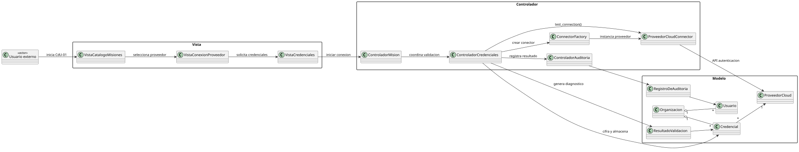
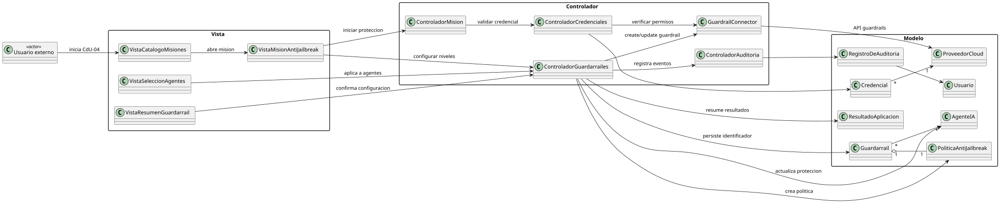

# Desarrollo de flujos de seguridad agéntica para aplicación de gobernanza de IA

## Modelo del dominio

## Actores encontrados

## Casos de uso por actor

### Usuario

### Proveedor cloud

## Diagrama de contexto

## CdU-01: Conectar proveedor cloud

### Detalle del caso de uso

[Detalle completo del caso de uso](Entregas/Capitulo2/CdU/DetalleCasosUso/DetalleCdU.md)

### Interfaz de usuario propuesta

### Análisis MVC

Archivo fuente del diagrama: [CdU01MVC.uml](Entregas/Capitulo3/Analisis/CasosUso/CdU01MVC.uml).

### Diseño

## CdU-04: Configurar protección anti-jailbreak

### Detalle del caso de uso

[Detalle completo del caso de uso](Entregas/Capitulo2/CdU/DetalleCasosUso/DetalleCdU.md)

### Interfaz de usuario propuesta

### Análisis MVC

Archivo fuente del diagrama: [CdU04MVC.uml](Entregas/Capitulo3/Analisis/CasosUso/CdU04MVC.uml).

### Diseño

## Conclusiones
